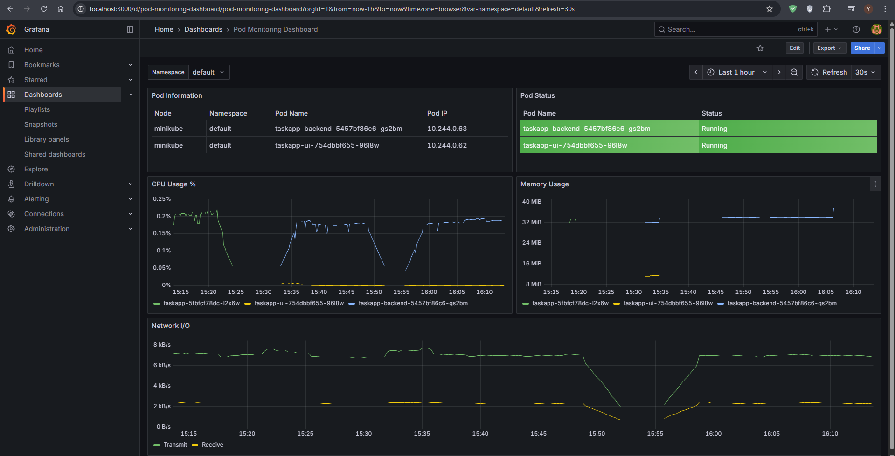

# Monitoring Setup with Prometheus & Grafana on Minikube

This guide explains how to set up Prometheus and Grafana on a Minikube cluster and use them to monitor a sample application (`taskapp`), which consists of two deployments:  
- `taskapp-backend`  
- `taskapp-ui`

---

## 1. Prerequisites
- [Minikube](https://minikube.sigs.k8s.io/docs/) installed and running  
- Helm installed and configured with your cluster  

---

## 2. Create a Namespace for Monitoring
```bash
kubectl create namespace monitoring
````

---

## 3. Add Helm Repositories

```bash
helm repo add prometheus-community https://prometheus-community.github.io/helm-charts
helm repo add grafana https://grafana.github.io/helm-charts
```

---

## 4. Install Prometheus

```bash
helm install prometheus prometheus-community/prometheus \
  --namespace monitoring \
  --set server.service.type=NodePort
```

---

## 5. Install Grafana

```bash
helm install grafana grafana/grafana \
  --namespace monitoring \
  --set service.type=NodePort
```

---

## 6. Access Prometheus & Grafana

Port-forward services locally:

```bash
kubectl port-forward svc/prometheus-server -n monitoring 9090:80 &
kubectl port-forward svc/grafana -n monitoring 3000:80 &
```

* Prometheus UI → [http://localhost:9090](http://localhost:9090)
* Grafana UI → [http://localhost:3000](http://localhost:3000)

---

## 7. Retrieve Grafana Admin Password

```bash
kubectl get secret --namespace monitoring grafana \
  -o jsonpath="{.data.admin-password}" | base64 --decode ; echo
```

Default username: **admin**
Password: *(use the decoded value above)*

---

## 8. Create Dashboard in Grafana

1. Login to Grafana at [http://localhost:3000](http://localhost:3000)
2. Add **Prometheus** as a data source (`http://prometheus-server.monitoring.svc.cluster.local`)
3. Import or create dashboards for monitoring pod metrics (CPU, memory, restarts, etc.)
4. Visualize metrics for `taskapp-backend` and `taskapp-ui` deployments.

---

---

## 9. Grafana Dashboard for Pod Monitoring

A custom **Grafana dashboard** was created to monitor the `taskapp-backend` and `taskapp-ui` pods.  
The dashboard includes the following panels:

- **Pod Information** (Namespace, Node, Pod Name, Pod IP)  
- **Pod Status** (Running, Pending, Failed, etc.)  
- **CPU Usage %** per pod  
- **Memory Usage** per pod  
- **Network I/O** (Transmit/Receive rates)

### Screenshot


### Dashboard JSON
You can import the following JSON into Grafana:

<details>
<summary>Click to view JSON</summary>

```json
{
  "annotations": {
    "list": [
      {
        "builtIn": 1,
        "datasource": {
          "type": "grafana",
          "uid": "-- Grafana --"
        },
        "enable": true,
        "hide": true,
        "iconColor": "rgba(0, 211, 255, 1)",
        "name": "Annotations & Alerts",
        "type": "dashboard"
      }
    ]
  },
  "editable": true,
  "fiscalYearStartMonth": 0,
  "graphTooltip": 0,
  "id": 3,
  "links": [],
  "panels": [
    {
      "datasource": {
        "type": "prometheus",
        "uid": "prometheus"
      },
      "fieldConfig": {
        "defaults": {
          "color": {
            "mode": "thresholds"
          },
          "custom": {
            "align": "auto",
            "cellOptions": {
              "type": "auto"
            },
            "filterable": false,
            "inspect": false
          },
          "mappings": [],
          "thresholds": {
            "mode": "absolute",
            "steps": [
              {
                "color": "green",
                "value": 0
              },
              {
                "color": "red",
                "value": 80
              }
            ]
          }
        },
        "overrides": [
          {
            "matcher": {
              "id": "byName",
              "options": "Namespace"
            },
            "properties": [
              {
                "id": "custom.width",
                "value": 141
              }
            ]
          },
          {
            "matcher": {
              "id": "byName",
              "options": "Pod Name"
            },
            "properties": [
              {
                "id": "custom.width",
                "value": 326
              }
            ]
          },
          {
            "matcher": {
              "id": "byName",
              "options": "Node"
            },
            "properties": [
              {
                "id": "custom.width",
                "value": 118
              }
            ]
          }
        ]
      },
      "gridPos": {
        "h": 5,
        "w": 12,
        "x": 0,
        "y": 0
      },
      "id": 1,
      "options": {
        "cellHeight": "sm",
        "footer": {
          "countRows": false,
          "fields": "",
          "reducer": [
            "sum"
          ],
          "show": false
        },
        "showHeader": true,
        "sortBy": []
      },
      "pluginVersion": "12.1.1",
      "targets": [
        {
          "datasource": {
            "type": "prometheus",
            "uid": "prometheus"
          },
          "editorMode": "builder",
          "expr": "kube_pod_info{namespace=~\"$namespace\"}",
          "format": "table",
          "instant": true,
          "legendFormat": "__auto",
          "range": false,
          "refId": "A"
        }
      ],
      "title": "Pod Information",
      "transformations": [
        {
          "id": "organize",
          "options": {
            "excludeByName": {
              "Time": true,
              "Value": true,
              "__name__": true,
              "app_kubernetes_io_component": true,
              "app_kubernetes_io_instance": true,
              "app_kubernetes_io_managed_by": true,
              "app_kubernetes_io_name": true,
              "app_kubernetes_io_part_of": true,
              "app_kubernetes_io_version": true,
              "created_by_kind": true,
              "created_by_name": true,
              "helm_sh_chart": true,
              "host_ip": true,
              "host_network": true,
              "instance": true,
              "job": true,
              "pod_ip": false,
              "service": true,
              "uid": true
            },
            "includeByName": {},
            "indexByName": {
              "Time": 0,
              "Value": 21,
              "__name__": 1,
              "app_kubernetes_io_component": 2,
              "app_kubernetes_io_instance": 3,
              "app_kubernetes_io_managed_by": 4,
              "app_kubernetes_io_name": 5,
              "app_kubernetes_io_part_of": 6,
              "app_kubernetes_io_version": 7,
              "created_by_kind": 8,
              "created_by_name": 9,
              "helm_sh_chart": 10,
              "host_ip": 11,
              "host_network": 12,
              "instance": 13,
              "job": 14,
              "namespace": 16,
              "node": 15,
              "pod": 17,
              "pod_ip": 18,
              "service": 19,
              "uid": 20
            },
            "renameByName": {
              "namespace": "Namespace",
              "node": "Node",
              "pod": "Pod Name",
              "pod_ip": "Pod IP"
            }
          }
        }
      ],
      "type": "table"
    },
    {
      "datasource": {
        "type": "prometheus",
        "uid": "prometheus"
      },
      "fieldConfig": {
        "defaults": {
          "color": {
            "mode": "thresholds"
          },
          "custom": {
            "align": "auto",
            "cellOptions": {
              "type": "color-background"
            },
            "inspect": false
          },
          "mappings": [
            {
              "options": {
                "Failed": {
                  "color": "red",
                  "index": 0
                },
                "Pending": {
                  "color": "yellow",
                  "index": 1
                },
                "Running": {
                  "color": "green",
                  "index": 2
                },
                "Succeeded": {
                  "color": "blue",
                  "index": 3
                },
                "Unknown": {
                  "color": "purple",
                  "index": 4
                }
              },
              "type": "value"
            }
          ],
          "thresholds": {
            "mode": "absolute",
            "steps": [
              {
                "color": "green",
                "value": 0
              },
              {
                "color": "red",
                "value": 80
              }
            ]
          }
        },
        "overrides": []
      },
      "gridPos": {
        "h": 5,
        "w": 12,
        "x": 12,
        "y": 0
      },
      "id": 2,
      "interval": "10s",
      "options": {
        "cellHeight": "sm",
        "footer": {
          "countRows": false,
          "fields": "",
          "reducer": [
            "sum"
          ],
          "show": false
        },
        "showHeader": true
      },
      "pluginVersion": "12.1.1",
      "targets": [
        {
          "datasource": {
            "type": "prometheus",
            "uid": "prometheus"
          },
          "disableTextWrap": false,
          "editorMode": "code",
          "exemplar": false,
          "expr": "kube_pod_status_phase{namespace=~\"$namespace\"} == 1",
          "format": "table",
          "fullMetaSearch": false,
          "hide": false,
          "includeNullMetadata": true,
          "instant": true,
          "interval": "",
          "legendFormat": "__auto",
          "range": false,
          "refId": "A",
          "useBackend": false
        }
      ],
      "title": "Pod Status",
      "transformations": [
        {
          "id": "organize",
          "options": {
            "excludeByName": {
              "Time": true,
              "Value": true,
              "__name__": true,
              "app_kubernetes_io_component": true,
              "app_kubernetes_io_instance": true,
              "app_kubernetes_io_managed_by": true,
              "app_kubernetes_io_name": true,
              "app_kubernetes_io_part_of": true,
              "app_kubernetes_io_version": true,
              "helm_sh_chart": true,
              "instance": true,
              "job": true,
              "namespace": true,
              "node": true,
              "service": true,
              "uid": true
            },
            "includeByName": {},
            "indexByName": {
              "Time": 0,
              "Value": 17,
              "__name__": 1,
              "app_kubernetes_io_component": 2,
              "app_kubernetes_io_instance": 3,
              "app_kubernetes_io_managed_by": 4,
              "app_kubernetes_io_name": 5,
              "app_kubernetes_io_part_of": 6,
              "app_kubernetes_io_version": 7,
              "helm_sh_chart": 8,
              "instance": 9,
              "job": 10,
              "namespace": 11,
              "node": 12,
              "phase": 14,
              "pod": 13,
              "service": 15,
              "uid": 16
            },
            "renameByName": {
              "namespace": "Namespace",
              "phase": "Status",
              "pod": "Pod Name"
            }
          }
        }
      ],
      "type": "table"
    },
    {
      "datasource": {
        "type": "prometheus",
        "uid": "prometheus"
      },
      "fieldConfig": {
        "defaults": {
          "color": {
            "mode": "palette-classic"
          },
          "custom": {
            "axisBorderShow": false,
            "axisCenteredZero": false,
            "axisColorMode": "text",
            "axisLabel": "",
            "axisPlacement": "auto",
            "barAlignment": 0,
            "barWidthFactor": 0.6,
            "drawStyle": "line",
            "fillOpacity": 0,
            "gradientMode": "none",
            "hideFrom": {
              "legend": false,
              "tooltip": false,
              "vis": false,
              "viz": false
            },
            "insertNulls": false,
            "lineInterpolation": "linear",
            "lineWidth": 1,
            "pointSize": 5,
            "scaleDistribution": {
              "type": "linear"
            },
            "showPoints": "auto",
            "spanNulls": false,
            "stacking": {
              "group": "A",
              "mode": "none"
            },
            "thresholdsStyle": {
              "mode": "off"
            }
          },
          "mappings": [],
          "thresholds": {
            "mode": "absolute",
            "steps": [
              {
                "color": "green",
                "value": 0
              },
              {
                "color": "red",
                "value": 80
              }
            ]
          },
          "unit": "percent"
        },
        "overrides": []
      },
      "gridPos": {
        "h": 8,
        "w": 12,
        "x": 0,
        "y": 5
      },
      "id": 3,
      "interval": "10s",
      "options": {
        "legend": {
          "calcs": [],
          "displayMode": "list",
          "placement": "bottom",
          "showLegend": true
        },
        "tooltip": {
          "hideZeros": false,
          "mode": "single",
          "sort": "none"
        }
      },
      "pluginVersion": "12.1.1",
      "targets": [
        {
          "datasource": {
            "type": "prometheus",
            "uid": "prometheus"
          },
          "disableTextWrap": false,
          "editorMode": "builder",
          "expr": "rate(container_cpu_usage_seconds_total{namespace=~\"$namespace\", pod!=\"\", container!=\"POD\"}[5m]) * 100",
          "fullMetaSearch": false,
          "includeNullMetadata": true,
          "legendFormat": "{{pod}}",
          "range": true,
          "refId": "A",
          "useBackend": false
        }
      ],
      "title": "CPU Usage %",
      "type": "timeseries"
    },
    {
      "datasource": {
        "type": "prometheus",
        "uid": "prometheus"
      },
      "fieldConfig": {
        "defaults": {
          "color": {
            "mode": "palette-classic"
          },
          "custom": {
            "axisBorderShow": false,
            "axisCenteredZero": false,
            "axisColorMode": "text",
            "axisLabel": "",
            "axisPlacement": "auto",
            "barAlignment": 0,
            "barWidthFactor": 0.6,
            "drawStyle": "line",
            "fillOpacity": 0,
            "gradientMode": "none",
            "hideFrom": {
              "legend": false,
              "tooltip": false,
              "vis": false,
              "viz": false
            },
            "insertNulls": false,
            "lineInterpolation": "linear",
            "lineWidth": 1,
            "pointSize": 5,
            "scaleDistribution": {
              "type": "linear"
            },
            "showPoints": "auto",
            "spanNulls": false,
            "stacking": {
              "group": "A",
              "mode": "none"
            },
            "thresholdsStyle": {
              "mode": "off"
            }
          },
          "mappings": [],
          "thresholds": {
            "mode": "absolute",
            "steps": [
              {
                "color": "green",
                "value": 0
              },
              {
                "color": "red",
                "value": 80
              }
            ]
          },
          "unit": "bytes"
        },
        "overrides": []
      },
      "gridPos": {
        "h": 8,
        "w": 12,
        "x": 12,
        "y": 5
      },
      "id": 4,
      "interval": "10s",
      "options": {
        "legend": {
          "calcs": [],
          "displayMode": "list",
          "placement": "bottom",
          "showLegend": true
        },
        "tooltip": {
          "hideZeros": false,
          "mode": "single",
          "sort": "none"
        }
      },
      "pluginVersion": "12.1.1",
      "targets": [
        {
          "datasource": {
            "type": "prometheus",
            "uid": "prometheus"
          },
          "editorMode": "code",
          "expr": "container_memory_usage_bytes{namespace=~\"$namespace\", pod!=\"\", container!=\"POD\"}",
          "legendFormat": "{{pod}}",
          "range": true,
          "refId": "A"
        }
      ],
      "title": "Memory Usage",
      "type": "timeseries"
    },
    {
      "datasource": {
        "type": "prometheus",
        "uid": "prometheus"
      },
      "fieldConfig": {
        "defaults": {
          "color": {
            "mode": "palette-classic"
          },
          "custom": {
            "axisBorderShow": false,
            "axisCenteredZero": false,
            "axisColorMode": "text",
            "axisLabel": "",
            "axisPlacement": "auto",
            "barAlignment": 0,
            "barWidthFactor": 0.6,
            "drawStyle": "line",
            "fillOpacity": 0,
            "gradientMode": "none",
            "hideFrom": {
              "legend": false,
              "tooltip": false,
              "vis": false,
              "viz": false
            },
            "insertNulls": false,
            "lineInterpolation": "linear",
            "lineWidth": 1,
            "pointSize": 5,
            "scaleDistribution": {
              "type": "linear"
            },
            "showPoints": "auto",
            "spanNulls": false,
            "stacking": {
              "group": "A",
              "mode": "none"
            },
            "thresholdsStyle": {
              "mode": "off"
            }
          },
          "mappings": [],
          "thresholds": {
            "mode": "absolute",
            "steps": [
              {
                "color": "green",
                "value": 0
              },
              {
                "color": "red",
                "value": 80
              }
            ]
          },
          "unit": "Bps"
        },
        "overrides": [
          {
            "matcher": {
              "id": "byRegexp",
              "options": "/.*receive.*/"
            },
            "properties": [
              {
                "id": "custom.transform",
                "value": "negative-Y"
              }
            ]
          }
        ]
      },
      "gridPos": {
        "h": 8,
        "w": 24,
        "x": 0,
        "y": 13
      },
      "id": 5,
      "options": {
        "legend": {
          "calcs": [],
          "displayMode": "list",
          "placement": "bottom",
          "showLegend": true
        },
        "tooltip": {
          "hideZeros": false,
          "mode": "single",
          "sort": "none"
        }
      },
      "pluginVersion": "12.1.1",
      "targets": [
        {
          "datasource": {
            "type": "prometheus",
            "uid": "prometheus"
          },
          "disableTextWrap": false,
          "editorMode": "code",
          "exemplar": false,
          "expr": "rate(container_network_transmit_bytes_total{interface=\"bridge\"}[5m])",
          "fullMetaSearch": false,
          "includeNullMetadata": true,
          "instant": false,
          "legendFormat": "Transmit",
          "range": true,
          "refId": "A",
          "useBackend": false
        },
        {
          "datasource": {
            "type": "prometheus",
            "uid": "prometheus"
          },
          "editorMode": "code",
          "expr": "rate(container_network_receive_bytes_total{interface=\"bridge\"}[5m])",
          "hide": false,
          "legendFormat": "Receive",
          "range": true,
          "refId": "B"
        }
      ],
      "title": "Network I/O",
      "type": "timeseries"
    }
  ],
  "preload": false,
  "refresh": "30s",
  "schemaVersion": 41,
  "tags": [
    "kubernetes",
    "pods"
  ],
  "templating": {
    "list": [
      {
        "current": {
          "text": "default",
          "value": "default"
        },
        "datasource": {
          "type": "prometheus",
          "uid": "prometheus"
        },
        "definition": "label_values(kube_pod_info, namespace)",
        "includeAll": true,
        "label": "Namespace",
        "name": "namespace",
        "options": [],
        "query": {
          "qryType": "",
          "query": "label_values(kube_pod_info, namespace)",
          "refId": "PrometheusVariableQueryEditor-VariableQuery"
        },
        "refresh": 1,
        "regex": "",
        "sort": 1,
        "type": "query"
      }
    ]
  },
  "time": {
    "from": "now-1h",
    "to": "now"
  },
  "timepicker": {},
  "timezone": "browser",
  "title": "Pod Monitoring Dashboard",
  "uid": "pod-monitoring-dashboard",
  "version": 8
}

```

